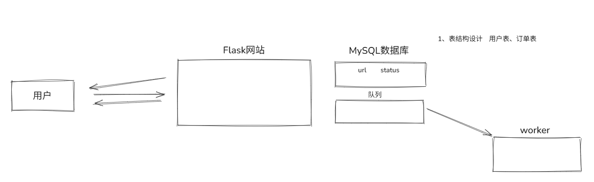

目标：基于Flask快速开发 某订单平台，实现下单后台自动执行




**功能开发**
基于flask的蓝图:看目录结构

1、用户登录

目标 基于 Flask 快速开发的订单平台示例，目标是实现下单后后台自动执行任务。

功能概览：

本文档简要说明实现思路与关键点，代码位于 `project/` 下的蓝图与 `utils/` 工具模块。

目录提示

查看 `project/` 下的 `views/`（如 `account.py`、`order.py`）和 `utils/`（如 `db.py`、`cache.py`）来了解实现细节。

用户登录

- 使用 Flask 蓝图（Blueprint）组织路由。
- 常用对象：`render_template`（渲染模板）、`request`（获取请求数据）、`redirect`（重定向）、`session`（会话存储）。

登录流程

1. 从表单获取用户输入（`request.form`）。
2. 使用 `pymysql`连接池查询用户信息：

```py
conn.cursor(cursor=DictCursor)
cursor.fetchone()  # 获取匹配到的第一条记录
```

3. 将查询结果保存到 `session`，并用 `redirect()` 跳转到目标页面。

注意 / TODO
- 支持注册功能（待完善）。

订单管理


订单列表

1. 从 `session.get()` 获取当前用户信息与角色。
2. 如果是管理员，查询所有订单：

```py
db.fetch_all(
    "select * from `order` left join userinfo on `order`.user_id = userinfo.id",
    []
)
```

说明：主表为 `order`（左表），通过 `LEFT JOIN` 关联 `userinfo` 补充用户信息，返回所有订单记录。

如果是普通用户：

```py
db.fetch_all(
    "select * from `order` left join userinfo on `order`.user_id = userinfo.id where `order`.user_id = %s",
    [user_info['user_id']]
)
```

说明：使用 `WHERE order.user_id = %s` 限定只返回当前用户的订单，并关联用户信息。

渲染页面

将查询结果传给模板：

```py
return render_template('order_list.html', data_list=data_list)
```

订单创建与后台执行

1. 从表单获取下单数据。
2. 插入到 MySQL（通过 `pymysql`），并获取 `order_id`：

```py
order_id = db.insert(
    'insert into `order`(url,count,user_id,status) values (%s,%s,%s,1)',
    params
)
# 或使用 cursor.lastrowid 获取新插入记录的 id
```

3. 将 `order_id` 推入 Redis 队列（`task_queue`）：

```py
conn.lpush('task_queue', order_id)
```

4. worker 从 `task_queue` 弹出任务（阻塞等待，超时 5s）：

- worker 在处理前会检查数据库中 `status` 是否仍为待执行状态。
- 执行完成后更新数据库状态为完成（例如 `status = 3`）。

队列与数据库同步（初始化场景）

当服务重启或丢失队列数据时，需要把数据库中 `status = 1`（待执行）但不在 Redis 队列的订单补回队列：

```py
# 从数据库获取所有待执行的订单 id
db_ids = db.fetch_all("select id from `order` where status = 1", [])
db_id_set = {row['id'] for row in db_ids}

# 从 redis 获取当前队列 id（示例）
total_count = conn.llen('task_queue')
cache_list = conn.lrange('task_queue', 0, total_count)
cache_int_list = {int(item.decode('utf-8')) for item in cache_list}

# 找到在 DB 但不在 redis 的 id，然后补回队列
need_push = list(db_id_set - cache_int_list)
if need_push:
    conn.lpush('task_queue', *need_push)
```

任务执行并发

使用线程池并发执行任务（示例）：

```py
from concurrent.futures import ThreadPoolExecutor

thread_pool = ThreadPoolExecutor(max_workers=150)
for _ in range(order_dict['count']):
    thread_pool.submit(task, order_dict)
thread_pool.shutdown(wait=True)
```

说明：创建最大 150 个线程并提交相应数量的任务；`shutdown(wait=True)` 等待所有任务完成后释放线程池。

状态更新

在任务开始/完成时更新数据库状态：

```py
db.insert("update `order` set status = %s where id = %s", [status, order_id])
```


TODO

- 完善注册流程和订单的分页的逻辑。


.venv\Scripts\activate 激活venv环境
